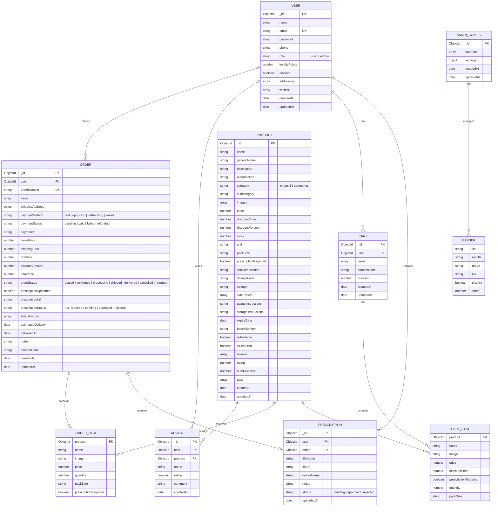

# Entity Relationship (ER) Diagram

This document details the database schema and relationship designs for the **PharmaEZ** Pharmacy & Healthcare E-Commerce system.

---

## Schema Definitions

### 1. User Schema
Stores all registered customer and administrator data. The `email` field is indexed and unique. Passwords are hashed using `bcryptjs` (10 salt rounds) via a Mongoose `pre('save')` hook before persisting. The `addresses` array allows multiple saved delivery addresses with an `isDefault` flag. The `prescriptions` sub-array tracks uploaded prescription files with status lifecycle (`pending → approved | rejected`). The `wishlist` array holds `ObjectId` references to `Product` documents. The `loyaltyPoints` field is auto-incremented on each successful order delivery (1 point per ₹10 spent).

### 2. Product Schema
Represents every healthcare product in the catalogue. In addition to standard e-commerce fields, it stores pharmacy-specific metadata: `genericName`, `saltComposition`, `dosageForm`, `strength`, `sideEffects`, `usageInstructions`, and `storageInstructions`. The `prescriptionRequired` boolean drives the Rx workflow throughout the application. The `category` field is constrained to an enum of 10 valid pharmacy categories. An embedded `reviews` array stores user feedback; `rating` and `numReviews` are aggregate fields recalculated on each review submission. A `pre('save')` hook auto-computes `discountPercent` from `price` and `discountPrice`.

### 3. Cart Schema
Ensures persistent shopping cart records linked one-to-one with a `User` (`unique: true`). Each item in the `items` array snapshots the product's price at time of adding to avoid stale pricing issues. Virtual fields `totalItems` and `subtotal` are computed dynamically using `.toJSON({ virtuals: true })` without persisting to the database.

### 4. Order Schema
Links users to their complete purchase history. The `orderNumber` field is auto-generated via a `pre('save')` hook using the format `PEZ` + last 6 digits of timestamp + 4-digit zero-padded sequence (e.g., `PEZ7829430001`). The `statusHistory` array provides a full audit trail — every status change is logged with a `timestamp` and optional `note`. The `prescriptionStatus` field links the order to the prescription review workflow for Rx items.

### 5. Prescription Schema (Embedded in User)
Tracks prescription files uploaded by users. Stored as an embedded sub-document array inside the `User` model. Each entry records the uploaded file URL, the prescribing doctor's name, admin review notes, and the current approval status. The admin dashboard surfaces these for pharmacist review.

### 6. Review Schema (Embedded in Product)
Collects customer feedback on individual products. Stored as an embedded array within `Product` documents. After each new review, the controller recalculates and persists the aggregate `rating` and `numReviews` on the parent Product document.

### 7. Admin Config Schema
A single-document collection (one record in the database) that stores global store settings — including the store name, support email, free shipping threshold (`₹499`), flat shipping charge (`₹49`), GST tax rate (`5%`), and homepage banner configuration.

---

[◄ Back to Project Architecture](../project_architecture.md) | [Back to Home](../README.md)
