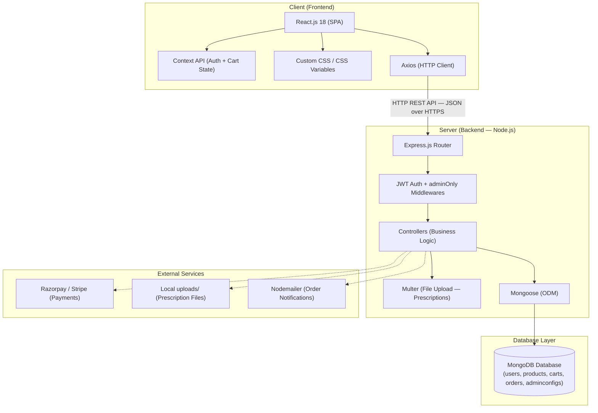

# Technical Architecture

This document describes the technical architecture of the **PharmaEZ** MERN Stack Pharmacy & Healthcare E-Commerce application.

## System Architecture Diagram

---

## Architectural Layers

### 1. Presentation Layer (Client-Side)

*   **React.js 18**: A component-based JavaScript library used to build the Single Page Application (SPA). Pages are structured around pharmacy workflows — browsing, Rx upload, checkout, and order tracking.
*   **Context API**: Centralized state management via two global providers:
    *   `AuthContext` — user session, JWT token, login/logout, profile refresh.
    *   `CartContext` — cart items, count, subtotal, add/update/remove/clear actions.
*   **Axios**: HTTP client with request interceptors that automatically attach the `Authorization: Bearer <token>` header on every API call, and a response interceptor to handle `401 Unauthorized` globally.
*   **React Router v6**: Declarative routing with protected routes (`ProtectedRoute`) for logged-in users and `AdminRoute` for admin-only pages.
*   **React Hot Toast**: Non-intrusive notification system for success/error feedback throughout the UI.
*   **React Icons**: Feather icon set used consistently across all components.

---

### 2. Router & Middleware Layer

*   **Express Router**: Handles endpoint mappings organized by domain:
    *   `/api/auth` — registration, login, profile, addresses, wishlist, prescriptions
    *   `/api/products` — product catalogue with full filter/search/pagination
    *   `/api/cart` — cart CRUD operations
    *   `/api/orders` — order placement, tracking, admin management
    *   `/api/admin` — users, prescriptions review, inventory, store config
*   **JWT Auth Middleware (`protect`)**: Verifies `Authorization: Bearer <token>` header on every protected endpoint. Populates `req.user` from the decoded token.
*   **Admin Middleware (`adminOnly`)**: Chained after `protect` — checks `req.user.role === 'admin'` and returns `403 Forbidden` otherwise.
*   **Multer Middleware**: Handles `multipart/form-data` for prescription file uploads (images and PDFs, max 5MB) and product image uploads (max 10MB, up to 5 files).
*   **Global Error Handler**: Catches all errors via `next(error)` — normalises Mongoose `CastError`, duplicate key, validation errors, and JWT errors into structured JSON responses.

---

### 3. Controller & Business Logic Layer

*   **authController**: Manages user registration (with bcryptjs hashing), login (JWT generation), profile CRUD, delivery address management, wishlist toggle, and prescription file upload.
*   **productController**: Handles product listings with MongoDB query building for keyword search (regex on name/genericName/tags), category filter, price range, prescription filter, sorting, and pagination. Manages reviews with aggregate rating recalculation.
*   **cartController**: Manages per-user cart documents. Validates stock availability on add/update. Computes prices from live product data.
*   **orderController**: Orchestrates the full order lifecycle — stock validation, stock deduction, loyalty point calculation and award, prescription status flagging for Rx items, order cancellation with stock restoration, and admin dashboard statistics aggregation.
*   **adminController**: Provides admin-only operations — user management (activate/deactivate), prescription review (approve/reject), inventory report generation (low-stock alerts, by-category breakdown), and store configuration management.

---

### 4. Data Access Layer

*   **Mongoose ODM**: Handles database schema validation, model construction, query generation, pre-save hooks (password hashing, order number generation, discount percent calculation), and virtual field computation (cart subtotal, totalItems).
*   **MongoDB**: Document-oriented NoSQL database storing records in BSON format. Collections: `users`, `products`, `carts`, `orders`, `adminconfigs`. Optimised for flexible schema evolution and high read/write throughput.

---

## Technology Stack Summary

| Layer | Technology | Version |
| :--- | :--- | :--- |
| Frontend Framework | React.js | 18.x |
| Build Tool | Vite | 5.x |
| Routing | React Router DOM | 6.x |
| HTTP Client | Axios | 1.x |
| State Management | Context API | Built-in |
| Backend Runtime | Node.js | 18+ |
| Backend Framework | Express.js | 4.x |
| Authentication | jsonwebtoken + bcryptjs | 9.x / 2.x |
| File Uploads | Multer | 1.x |
| Database | MongoDB | 6+ |
| ODM | Mongoose | 8.x |
| Notifications | React Hot Toast | 2.x |
| Icons | React Icons (Feather) | 4.x |

---

[◄ Back to Project Architecture](../project_architecture.md) | [Back to Home](../README.md)
