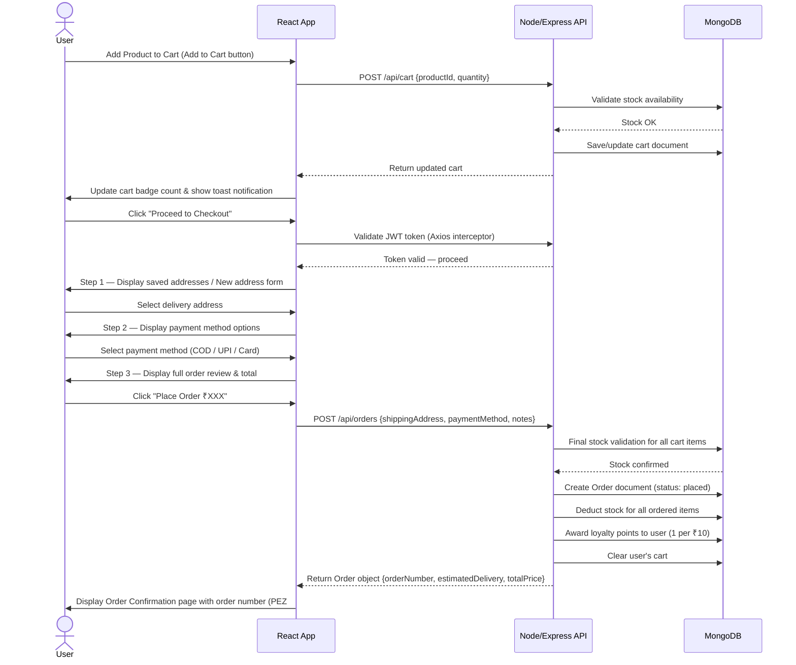
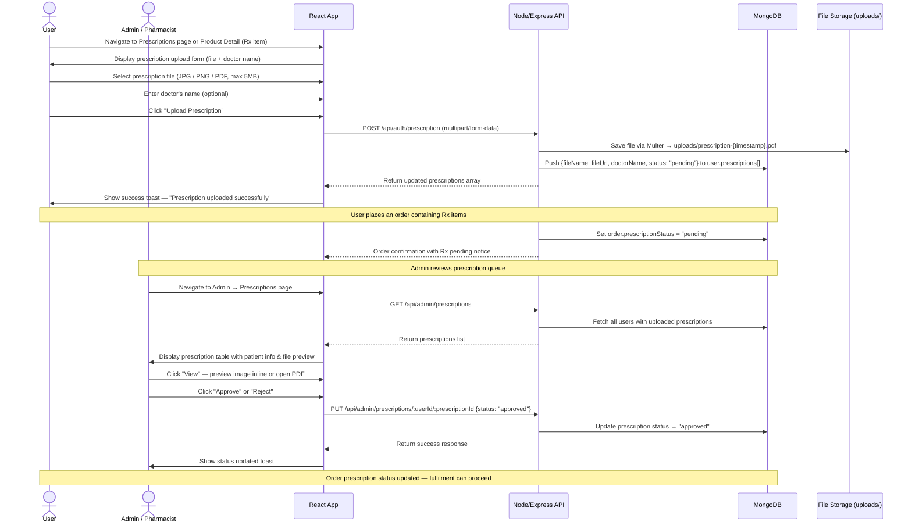
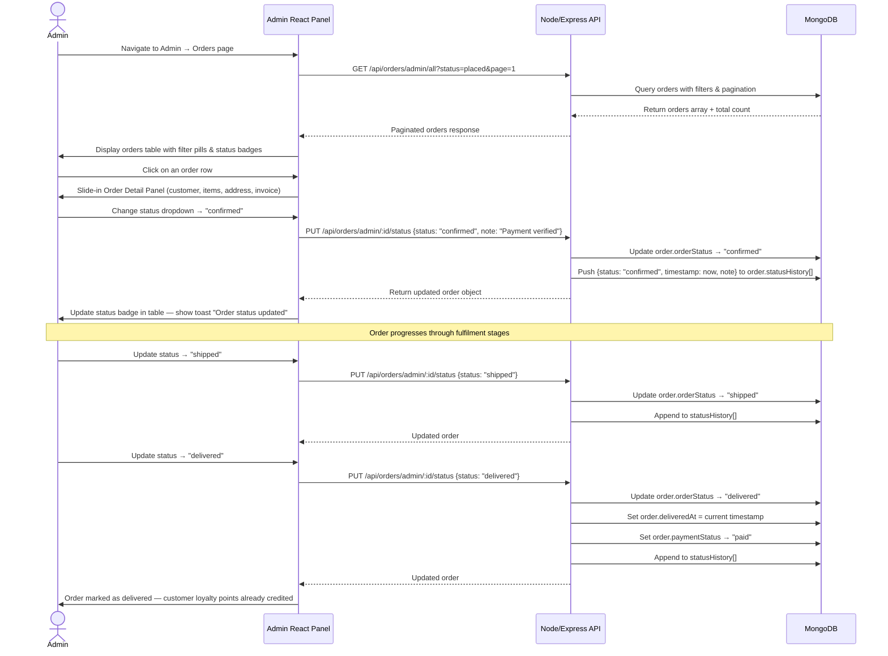
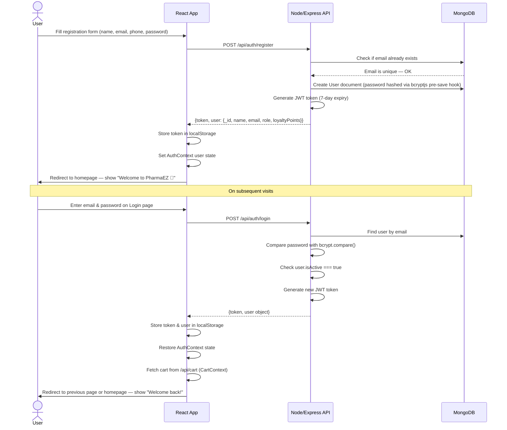

# User Flows

This document maps out the key user journeys in the **PharmaEZ** Pharmacy & Healthcare E-Commerce platform.

---

## 1. Customer Checkout Flow

This diagram outlines how a user adds healthcare products to the cart, proceeds through the 3-step checkout, and successfully places an order — including stock validation and loyalty point award.

---

## 2. Prescription Upload & Verification Flow

This diagram shows the end-to-end Rx (prescription medicine) workflow — from a customer uploading a prescription to a pharmacist/admin approving it and the order proceeding to fulfilment.

---

## 3. Admin Order Management Flow

This diagram outlines how an administrator manages the order lifecycle — from viewing placed orders to updating fulfilment status — with a full audit trail.

---

## 4. User Registration & Login Flow

---

[◄ Back to Project Architecture](../project_architecture.md) | [Back to Home](../README.md)
